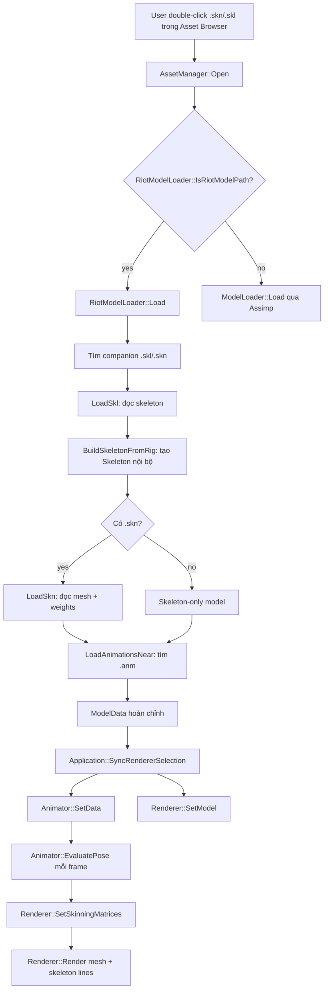
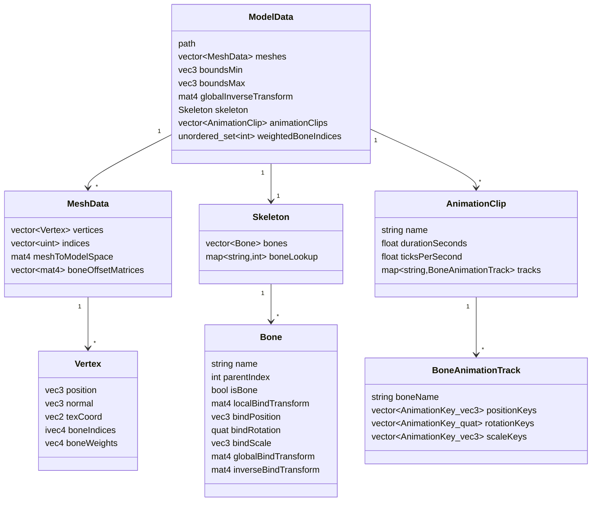
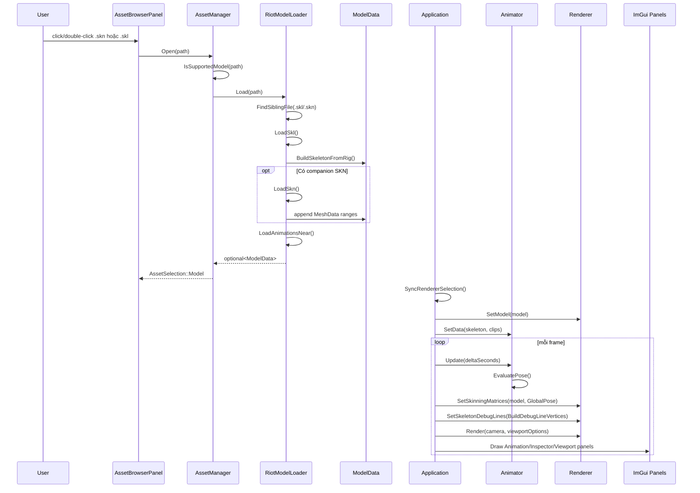
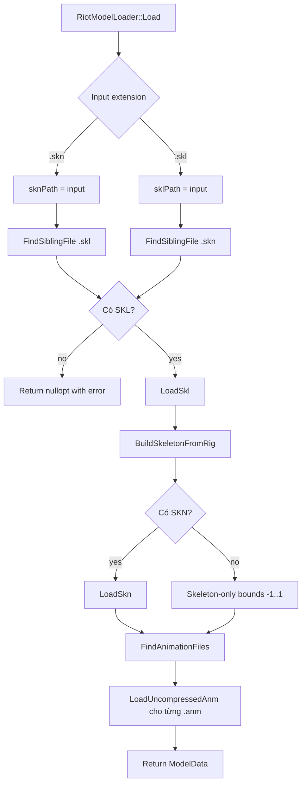
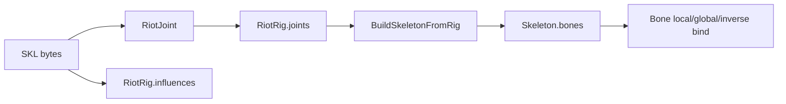
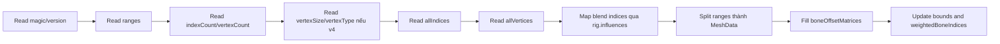
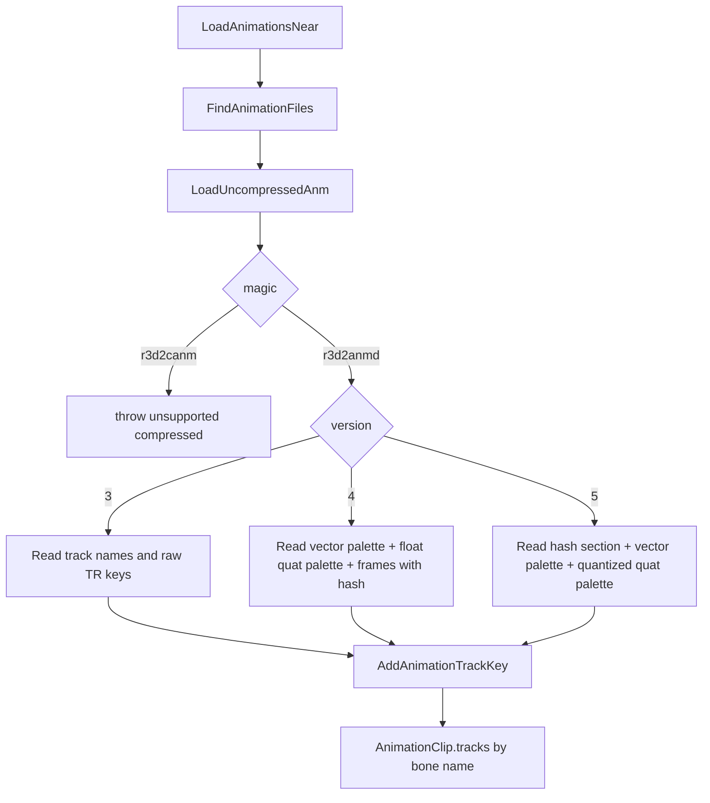
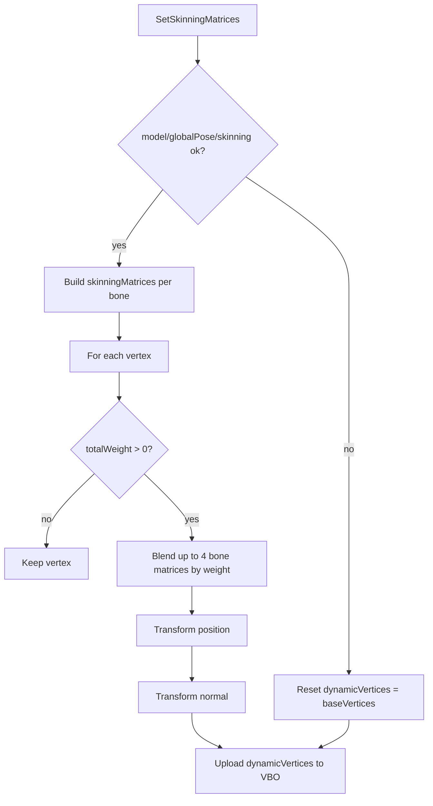
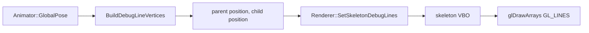
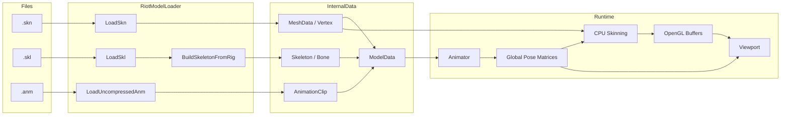

# Riot SKN/SKL/ANM Implementation Notes

Tài liệu này tổng hợp cách project hiện tại đọc bộ file native của League of Legends và đưa dữ liệu lên viewport:

- `.skn`: skinned mesh, gồm vertex, index, submesh/material range và skin weights.
- `.skl`: skeleton/rig, gồm joint hierarchy, bind pose và influence map.
- `.anm`: animation clip, gồm keyframe transform theo bone.

Mục tiêu của implementation không phải thay thế Assimp. Assimp vẫn dùng cho `.fbx`, `.gltf`, `.glb`, `.obj`. Loader Riot là một đường riêng để đọc trực tiếp format LoL, sau đó đổ dữ liệu vào cùng các struct nội bộ như `ModelData`, `Skeleton`, `MeshData`, `Vertex`, `AnimationClip`. Nhờ vậy renderer, animator và UI không cần biết model đến từ Assimp hay Riot native file.

## Tổng Quan Flow



Các file chính:

- `src/assets/RiotModelLoader.h`: khai báo public API của loader Riot.
- `src/assets/RiotModelLoader.cpp`: đọc `.skn`, `.skl`, `.anm`, tìm companion file và build `ModelData`.
- `src/assets/AssetManager.cpp`: route `.skn/.skl` sang `RiotModelLoader`.
- `src/assets/ModelLoader.h`: khai báo struct nội bộ `Vertex`, `MeshData`, `ModelData`.
- `src/assets/ModelLoader.cpp`: loader Assimp cho FBX/glTF/OBJ, dùng chung contract `ModelData`.
- `src/animation/Bone.h`, `Skeleton.h`, `AnimationClip.h`: dữ liệu skeleton và animation nội bộ.
- `src/animation/Animator.cpp`: sample animation, tính global pose và tạo debug skeleton lines.
- `src/renderer/Renderer.cpp`: upload mesh, CPU skinning, vẽ mesh và skeleton debug lines.
- `src/core/Application.cpp`: glue giữa UI state, animator và renderer.

## Bản Đồ Implementation Theo File

| File | Vai trò | Điểm cần nhớ |
| --- | --- | --- |
| `src/assets/AssetManager.cpp` | Phân loại asset khi user click trong Asset Browser. | `.skn/.skl` được coi là model nếu `RiotModelLoader::IsRiotModelPath` trả về true. |
| `src/assets/RiotModelLoader.h` | Public API của Riot native loader. | Chỉ expose `IsRiotModelPath` và `Load`. Parser chi tiết nằm trong `.cpp`. |
| `src/assets/RiotModelLoader.cpp` | Parse SKL/SKN/ANM, tìm companion file, build `ModelData`. | Đây là nơi chứa phần hiểu biết về binary format của Riot. |
| `src/assets/ModelLoader.h` | Định nghĩa contract nội bộ `Vertex`, `MeshData`, `ModelData`. | Mọi loader đều phải quy dữ liệu về các struct này. |
| `src/assets/ModelLoader.cpp` | Loader Assimp cho FBX/glTF/OBJ. | Hữu ích để so sánh cách build skeleton, mesh offset và animation track. |
| `src/animation/Bone.h` | Một bone/joint trong skeleton nội bộ. | Lưu local bind, global bind, inverse bind và TRS bind đã decompose. |
| `src/animation/Skeleton.h` | Danh sách bone và lookup name -> index. | Riot dùng index trực tiếp từ SKL nhưng vẫn fill lookup để UI/ANM hash dùng được. |
| `src/animation/AnimationClip.h` | Clip, track và key nội bộ. | Track map theo tên bone, key đã đổi sang đơn vị giây. |
| `src/animation/Animator.cpp` | Runtime animation sampler. | Sample TRS, build global pose, tạo line vertices để vẽ skeleton. |
| `src/renderer/Renderer.cpp` | OpenGL upload/draw, CPU skinning. | Skinning làm trên CPU rồi update VBO, shader không nhận bone matrices. |
| `src/core/Application.cpp` | Main loop và glue code. | `SyncRendererSelection` cấp model mới cho renderer/animator; mỗi frame gọi skinning và skeleton lines. |
| `src/ui/AnimationPanel.cpp` | UI điều khiển animation. | Show skeleton, pause/play, step, speed, loop, time slider, enable skinning. |
| `src/ui/InspectorPanel.cpp` | UI thông tin model/skeleton. | Đếm vertices, weighted vertices, weighted bones, bone tree và selected bone data. |

## Index Hàm Đã Implement

### Asset routing

| Hàm | File | Ý nghĩa |
| --- | --- | --- |
| `AssetManager::IsSupportedModel` | `AssetManager.cpp` | Kiểm tra extension model. Ngoài `.obj/.fbx/.gltf/.glb`, hàm gọi thêm `RiotModelLoader::IsRiotModelPath`. |
| `AssetManager::Open` | `AssetManager.cpp` | Tạo `AssetSelection`. Nếu là `.skn/.skl` thì gọi `RiotModelLoader::Load`; nếu là model thường thì gọi `ModelLoader::Load`. |
| `RiotModelLoader::IsRiotModelPath` | `RiotModelLoader.cpp` | Trả về true cho `.skn` và `.skl`. `.anm` không mở riêng vì animation cần skeleton để map track vào bone name. |
| `RiotModelLoader::Load` | `RiotModelLoader.cpp` | Entry point chính: tìm `.skl/.skn`, đọc skeleton, đọc mesh nếu có, tìm `.anm`, trả về `ModelData`. |

### Binary helpers và parser Riot

| Hàm/struct | File | Ý nghĩa |
| --- | --- | --- |
| `BinaryReader::Read<T>` | `RiotModelLoader.cpp` | Đọc primitive little-endian từ stream. |
| `BinaryReader::ReadFixedString` | `RiotModelLoader.cpp` | Đọc string có kích thước cố định, cắt tại byte `\0`. Dùng cho legacy SKL, material range, ANM v3 track name. |
| `BinaryReader::ReadNullTerminatedString` | `RiotModelLoader.cpp` | Đọc string đến byte `\0`. Dùng cho modern SKL bone name offset. |
| `BinaryReader::ReadVec2/ReadVec3/ReadQuat` | `RiotModelLoader.cpp` | Đọc vector/quaternion Riot và convert sang GLM. `ReadQuat` đọc x/y/z/w rồi tạo `glm::quat(w,x,y,z)`. |
| `BinaryReader::Seek/Tell/Size` | `RiotModelLoader.cpp` | Di chuyển offset trong binary. `Size` hiện có nhưng chưa dùng trong pass hiện tại. |
| `ElfHashLower` | `RiotModelLoader.cpp` | Hash tên bone lower-case để match ANM v4/v5 joint hash với `Skeleton::bones`. |
| `ComposeTransform` | `RiotModelLoader.cpp` | Tạo matrix `T * R * S` từ translation, rotation, scale. |
| `DecompressQuantizedQuaternion` | `RiotModelLoader.cpp` | Giải nén quaternion 6 byte của ANM v5. |
| `ReadLegacyGlobalTransform` | `RiotModelLoader.cpp` | Đọc matrix 3x4 của legacy SKL thành `glm::mat4`. |
| `LoadSkl` | `RiotModelLoader.cpp` | Parse modern/legacy SKL thành `RiotRig`. |
| `BuildSkeletonFromRig` | `RiotModelLoader.cpp` | Convert `RiotRig` thành `ModelData::skeleton`. |
| `ExpandBounds` | `RiotModelLoader.cpp` | Cập nhật `boundsMin/boundsMax` theo vertex position. |
| `LoadSkn` | `RiotModelLoader.cpp` | Parse SKN thành `MeshData`, map influence -> bone, chia range thành mesh con. |
| `FindSiblingFile` | `RiotModelLoader.cpp` | Tìm companion `.skl` hoặc `.skn`: ưu tiên cùng stem, fallback file đầu tiên cùng extension trong folder. |
| `FindAnimationFiles` | `RiotModelLoader.cpp` | Tìm `.anm` trong folder skeleton và folder con `Animations`. |
| `AddAnimationTrackKey` | `RiotModelLoader.cpp` | Thêm position/rotation/scale key vào track của clip. |
| `LoadUncompressedAnm` | `RiotModelLoader.cpp` | Parse `r3d2anmd` v3/v4/v5 thành `AnimationClip`. |
| `LoadAnimationsNear` | `RiotModelLoader.cpp` | Duyệt các `.anm` tìm thấy, load từng clip, log warning nếu clip không hỗ trợ. |

### Assimp path dùng chung contract

| Hàm | File | Ý nghĩa |
| --- | --- | --- |
| `ModelLoader::Load` | `ModelLoader.cpp` | Import FBX/glTF/OBJ bằng Assimp, convert thành `ModelData`. |
| `AddBoneInfluence` | `ModelLoader.cpp` | Thêm influence vào 4 slot của vertex, giữ 4 weight lớn nhất. |
| `NormalizeBoneWeights` | `ModelLoader.cpp` | Chuẩn hóa tổng weight về 1. Riot path hiện đọc weight raw từ file và không gọi hàm này. |
| `BuildSkeletonFromSkinnedBones` | `ModelLoader.cpp` | Build skeleton từ node hierarchy của Assimp dựa trên bone names có skin weight. |
| `CollectMeshNodeTransforms` | `ModelLoader.cpp` | Lấy transform của node chứa mesh để đưa vertex về model space. |
| `LogBindPoseDiagnostics` | `ModelLoader.cpp` | Tính bind pose error để debug skinning của Assimp model. |
| `ConvertKeys` | `ModelLoader.cpp` | Convert Assimp animation keys sang `AnimationKey` nội bộ theo seconds. |

### Runtime animation và render

| Hàm | File | Ý nghĩa |
| --- | --- | --- |
| `Animator::SetData` | `Animator.cpp` | Nhận con trỏ tới skeleton/clips của model đang chọn, reset time, chọn clip 0 nếu có. |
| `Animator::Update` | `Animator.cpp` | Nếu playing thì step time, nếu pause thì vẫn evaluate pose để sync bind/selected state. |
| `Animator::SetActiveClip` | `Animator.cpp` | Đổi clip đang play, reset time về 0. |
| `Animator::SetCurrentTime` | `Animator.cpp` | Seek animation bằng giây, clamp trong duration. |
| `Animator::Step` | `Animator.cpp` | Tiến/lùi time theo delta, xử lý loop hoặc stop tại cuối clip. |
| `Animator::EvaluatePose` | `Animator.cpp` | Sample local TRS cho từng bone, nhân theo hierarchy để ra `m_globalPose`. |
| `Animator::ValidateClip` | `Animator.cpp` | Chặn clip/key invalid: duration không hợp lệ, NaN/Inf trong key. |
| `Animator::BuildDebugLineVertices` | `Animator.cpp` | Tạo các cặp điểm parent-child từ animated global pose để renderer vẽ `GL_LINES`. |
| `Animator::BuildBindDebugLineVertices` | `Animator.cpp` | Tạo skeleton line theo bind pose. Hiện có trong code nhưng runtime đang dùng animated pose. |
| `Animator::BoneMovementDistance` | `Animator.cpp` | Tính khoảng cách bone hiện tại so với bind pose, dùng trong Inspector. |
| `Renderer::SetModel` | `Renderer.cpp` | Tạo VAO/VBO/EBO cho mỗi `MeshData`, lưu `baseVertices` và `dynamicVertices`. |
| `Renderer::SetSkinningEnabled` | `Renderer.h` | Bật/tắt CPU skinning từ Animation panel. |
| `Renderer::SetSkinningMatrices` | `Renderer.cpp` | Tính skin matrix cho từng bone, blend vertex trên CPU, update VBO. |
| `Renderer::SetSkeletonDebugLines` | `Renderer.cpp` | Upload line vertices của skeleton vào skeleton VBO. |
| `Renderer::Render` | `Renderer.cpp` | Render grid, mesh triangles, skeleton lines vào framebuffer viewport. |
| `Application::SyncRendererSelection` | `Application.cpp` | Khi selection đổi, đẩy model vào renderer/animator, focus camera, reset selected bone. |
| `Application::Run` | `Application.cpp` | Main loop: update animator, camera, skinning, skeleton lines, render, vẽ ImGui panels. |

## Structure Dữ Liệu Nội Bộ

Loader Riot chỉ nên parse byte-level format ở biên ngoài. Sau đó dữ liệu phải được đưa vào các struct nội bộ dưới đây. Từ lúc vào renderer/animator, code không nên phụ thuộc `.skn/.skl/.anm` nữa.



### `Vertex`

- `position`: vị trí vertex ở model space. Riot path đọc trực tiếp từ SKN; Assimp path transform từ mesh local sang model space.
- `normal`: normal ở model space. Renderer dùng để tính lighting đơn giản.
- `texCoord`: UV0. Hiện tại shader chưa sample texture nhưng loader đã giữ sẵn.
- `boneIndices`: tối đa 4 bone index đã map sang index trong `Skeleton::bones`.
- `boneWeights`: tối đa 4 weight từ file. CPU skinning blend 4 matrix theo weight này.

### `MeshData`

- `vertices`: vertex bind/original. Renderer copy vào `GpuMesh::baseVertices`.
- `indices`: index triangles. Riot path đọc U16 từ SKN rồi lưu thành `unsigned int`.
- `meshToModelSpace`: dùng chính cho Assimp path vì mesh có node transform riêng. Riot path để identity.
- `boneOffsetMatrices`: inverse bind theo từng bone trong mesh. Riot path set từ `Bone::inverseBindTransform`.

### `Bone`

- `parentIndex`: index parent trong vector bone, `-1` nếu root.
- `localBindTransform`: transform local so với parent tại bind pose.
- `bindPosition/bindRotation/bindScale`: TRS decompose từ `localBindTransform`, làm fallback khi track animation thiếu key.
- `globalBindTransform`: transform bone trong model space tại bind pose.
- `inverseBindTransform`: matrix đưa vertex từ model/bind space về bone bind space, dùng trong công thức skinning.

### `AnimationClip`

- `durationSeconds`: độ dài clip đã convert sang giây.
- `ticksPerSecond`: tốc độ key/tick tham khảo. Riot v4/v5 lấy `1 / frameDuration`.
- `tracks`: map theo bone name. `Animator::EvaluatePose` tìm track bằng `clip->tracks.find(bone.name)`.

## Flow Chi Tiết Từ Click File Đến Viewport

Flow đầy đủ gồm 3 phase: import, runtime update, render.



### Import phase

1. User mở `.skn` hoặc `.skl`.
2. `AssetManager::Open` tạo `AssetSelection`.
3. Nếu extension là Riot model, `RiotModelLoader::Load` chạy.
4. Loader quyết định input chính:
   - input `.skn`: đây là mesh, cần tìm `.skl` companion.
   - input `.skl`: đây là skeleton, có thể tìm `.skn` companion để có mesh.
5. Không có `.skl` thì fail, vì mesh skinning và animation cần skeleton.
6. `LoadSkl` parse skeleton raw thành `RiotRig`.
7. `BuildSkeletonFromRig` tạo `ModelData::skeleton`.
8. Nếu có `.skn`, `LoadSkn` tạo `ModelData::meshes`, `weightedBoneIndices`, `boundsMin/boundsMax`.
9. `LoadAnimationsNear` tìm và load `.anm`.
10. Loader trả về `ModelData` hoàn chỉnh.

### Runtime update phase

1. `Application::SyncRendererSelection` phát hiện path model đã đổi.
2. `Renderer::SetModel` tạo GPU resources cho mesh.
3. `Animator::SetData` trỏ vào skeleton/clips của model đang chọn.
4. Mỗi frame, `Animator::Update` cập nhật time và `EvaluatePose`.
5. `EvaluatePose` lưu kết quả trong `Animator::m_globalPose`.
6. `Application::Run` đưa `GlobalPose` vào `Renderer::SetSkinningMatrices`.
7. Nếu `enableSkinning = false`, renderer reset VBO về bind/original vertices.

### Render phase

1. Renderer bind framebuffer của viewport.
2. Clear color/depth.
3. Vẽ grid nếu `showGrid`.
4. Vẽ mesh triangles nếu có model.
5. Vẽ skeleton lines nếu `showSkeleton`.
6. Viewport panel show `Renderer::OutputTexture()` bằng ImGui image.

## Cách Route Từ AssetManager

`AssetManager::IsSupportedModel` xem `.skn` và `.skl` là model:

```cpp
return ext == ".obj" || ext == ".fbx" || ext == ".gltf" || ext == ".glb" || RiotModelLoader::IsRiotModelPath(path);
```

Khi `Open` một model:

```cpp
if (RiotModelLoader::IsRiotModelPath(path))
{
    selection.model = RiotModelLoader::Load(path, errorMessage);
}
else
{
    selection.model = ModelLoader::Load(path, errorMessage);
}
```

Kết quả là UI không cần selection type riêng cho Riot. Nếu loader trả về `ModelData`, viewport và animation panel dùng lại giống FBX.

## Flow Đọc File Riot



### Khi mở `.skn`

```text
input = Foo.skn
sknPath = Foo.skn
sklPath = Foo.skl nếu tồn tại
nếu Foo.skl không tồn tại, lấy .skl đầu tiên trong cùng folder
```

Nếu không tìm thấy `.skl`, loader dừng lại vì:

- SKN chỉ biết blend index và weight.
- Bone index đúng thực tế nằm trong SKL influence map.
- Inverse bind transform nằm trong skeleton.

### Khi mở `.skl`

```text
input = Foo.skl
sklPath = Foo.skl
sknPath = Foo.skn nếu tồn tại
nếu Foo.skn không tồn tại, lấy .skn đầu tiên trong cùng folder
```

Nếu không tìm thấy `.skn`, vẫn load skeleton-only:

- `model.meshes` rỗng.
- `boundsMin = (-1,-1,-1)`.
- `boundsMax = (1,1,1)`.
- Renderer không vẽ mesh nhưng skeleton debug lines vẫn có nếu có bones.

### Tìm animation

`FindAnimationFiles` tìm `.anm` trong:

- folder chứa `.skl`.
- folder con `Animations`.

Sau đó sort và unique để tránh load trùng file.

## BinaryReader

`RiotModelLoader.cpp` có helper nhỏ `BinaryReader` để đọc file binary:

```cpp
template <typename T>
T Read();

std::string ReadFixedString(std::size_t size);
std::string ReadNullTerminatedString();
glm::vec2 ReadVec2();
glm::vec3 ReadVec3();
glm::quat ReadQuat();
void Seek(std::streamoff offset);
std::streamoff Tell();
std::streamoff Size();
```

Các điểm quan trọng:

- `Read<T>` đọc trực tiếp bytes vào scalar. Target hiện tại là Windows/x86-64 little-endian nên cách này ổn cho pass đầu.
- `ReadFixedString(size)` đọc string có độ dài cố định và cắt tại `\0`.
- `ReadNullTerminatedString()` dùng cho string có offset trong modern SKL.
- `ReadQuat()` đọc thứ tự Riot `x, y, z, w`, sau đó tạo `glm::quat(w, x, y, z)` và normalize.
- `Seek` và `Tell` rất quan trọng vì modern SKL/ANM dùng nhiều section offset.

Nếu sau này cần cross-platform nghiêm ngặt hơn, nên thêm endian conversion rõ ràng thay vì đọc thẳng bytes.

## Structure Tạm Thời Trong Riot Loader

Các struct này chỉ sống trong `RiotModelLoader.cpp`, dùng để parse Riot format trước khi convert sang `ModelData`.

```cpp
struct RiotJoint
{
    std::string name;
    int id;
    int parentId;
    glm::mat4 localTransform;
    glm::mat4 inverseBindTransform;
};
```

`RiotJoint` là joint đọc từ `.skl`.

```cpp
struct RiotRig
{
    std::vector<RiotJoint> joints;
    std::vector<int> influences;
};
```

`RiotRig` gồm joint hierarchy và influence map. Influence map rất quan trọng vì `.skn` không lưu joint id trực tiếp trong vertex. Nó lưu blend index, rồi blend index cần map qua `rig.influences`.

```cpp
struct RiotRange
{
    std::string material;
    int startVertex;
    int vertexCount;
    int startIndex;
    int indexCount;
};
```

`RiotRange` tương ứng submesh/material range trong `.skn`.

```cpp
struct RiotAnimationFrame
{
    std::uint16_t translationId;
    std::uint16_t scaleId;
    std::uint16_t rotationId;
};
```

Animation frame không lưu trực tiếp vector/quaternion. Nó lưu index vào vector palette và quaternion palette.

## Cách Lấy Bone Từ SKL

SKL được parse thành `RiotRig`, sau đó build thành `Skeleton`.



### Nhận dạng SKL

`LoadSkl` hỗ trợ hai dạng:

```text
Modern SKL:
- file offset 4 là format token 0x22FD4FC3
- version 0

Legacy SKL:
- magic "r3d2sklt"
- version 1 hoặc 2
```

### Modern SKL

Modern SKL có header chứa offsets:

```text
fileSize
formatToken
version
flags
jointCount
influenceCount
jointsOffset
jointIndicesOffset
influencesOffset
nameOffset
assetNameOffset
boneNamesOffset
reserved offsets...
```

Loader nhảy đến `jointsOffset` để đọc từng joint. Mỗi joint hiện được đọc như sau:

```text
flags: uint16
id: int16
parentId: int16
padding: int16
nameHash: uint32
radius: float

localTranslation: vec3
localScale: vec3
localRotation: quat

inverseBindTranslation: vec3
inverseBindScale: vec3
inverseBindRotation: quat

relativeNameOffset: int32
```

Name không nằm inline ở đầu joint. File lưu offset từ vị trí field `relativeNameOffset`, nên code làm:

```cpp
const std::streamoff returnOffset = reader.Tell();
reader.Seek(returnOffset - 4 + relativeNameOffset);
const std::string name = reader.ReadNullTerminatedString();
reader.Seek(returnOffset);
```

Transform được compose thành matrix:

```text
localTransform = T * R * S
inverseBindTransform = T * R * S
```

Trong code:

```cpp
ComposeTransform(localTranslation, localRotation, localScale)
```

### Legacy SKL

Legacy SKL có magic:

```text
"r3d2sklt"
```

Version hỗ trợ:

```text
1
2
```

Mỗi joint legacy đọc:

```text
name: padded string 32 bytes
parentId: int32
radius: float
global transform: 3x4 floats
```

Legacy lưu global bind transform, nên code tính local transform bằng:

```text
local = inverse(parentGlobal) * global
```

Nếu bone không có parent:

```text
local = global
```

Inverse bind:

```text
inverseBindTransform = inverse(globalTransform)
```

### Influence map trong SKL

Influence map dùng để map vertex blend index của `.skn` sang joint id:

```text
SKN vertex blend index -> SKL influences array -> joint id
```

Modern SKL đọc influence tại `influencesOffset`, mỗi influence là `int16`.

Legacy SKL:

- version 2: đọc influence count và các `uint32`.
- version 1: không có influence table, mặc định `influences[i] = i`.

### Build skeleton nội bộ

`BuildSkeletonFromRig` chuyển `RiotRig` sang `Skeleton`:

```cpp
Bone& bone = model.skeleton.bones[i];
bone.name = joint.name;
bone.parentIndex = joint.parentId;
bone.isBone = true;
bone.localBindTransform = joint.localTransform;
bone.inverseBindTransform = joint.inverseBindTransform;
```

Sau đó `glm::decompose` local matrix để lấy:

```text
bindPosition
bindRotation
bindScale
```

Và tính `globalBindTransform` theo parent:

```cpp
bone.globalBindTransform = parent.globalBindTransform * bone.localBindTransform;
```

Kết quả:

```text
SKL RiotRig -> Skeleton nội bộ -> Animator/Renderer dùng lại được
```

## Cách Lấy Mesh Từ SKN

`LoadSkn` làm việc theo thứ tự byte-level sau:



### Header và version

SKN bắt đầu bằng magic:

```text
0x00112233
```

Sau magic là:

```text
major: uint16
minor: uint16
```

Version hỗ trợ:

```text
major 0, minor 1
major 2, minor 1
major 4, minor 1
```

Nếu `(major, minor)` không nằm trong danh sách trên, loader throw `Unsupported SKN version`.

### Ranges/Submeshes

Với major 0:

```text
indexCount: int32
vertexCount: int32
range mặc định:
  material = "Base"
  startVertex = 0
  vertexCount = vertexCount
  startIndex = 0
  indexCount = indexCount
```

Với major 2/4:

```text
rangeCount: uint32
range[rangeCount]
```

Mỗi range:

```text
material: padded string 64 bytes
startVertex: int32
vertexCount: int32
startIndex: int32
indexCount: int32
```

Code hiện convert mỗi range thành một `MeshData` riêng:

```text
RiotRange 0 -> model.meshes[0]
RiotRange 1 -> model.meshes[1]
...
```

Điều này giúp renderer vẽ từng material range như mesh con, dù hiện tại material/texture chưa được bind riêng. `material` mới chỉ được đọc vào `RiotRange`, chưa lưu vào `MeshData`.

### Vertex format

Với major 4, file có:

```text
flags: uint32
indexCount: int32
vertexCount: int32
vertexSize: uint32
vertexType: uint32
boundingBox: 6 floats
boundingSphere: 4 floats
```

Loader hiện hỗ trợ vertex size:

```text
52: Basic
56: Color
72: Tangent
```

Core layout:

```text
position: vec3 float32      12 bytes
blendIndex: packed 4 bytes  4 bytes
blendWeight: vec4 float32   16 bytes
normal: vec3 float32        12 bytes
uv0: vec2 float32           8 bytes
```

Tổng:

```text
12 + 4 + 16 + 12 + 8 = 52 bytes
```

Nếu `vertexSize >= 56`, loader skip primary color 4 bytes. Nếu `vertexSize >= 72`, loader skip tangent 16 bytes.

### Index buffer

SKN index buffer hiện đọc là U16:

```cpp
allIndices[i] = reader.Read<std::uint16_t>();
```

Sau khi chia range, index được remap từ global vertex index về local mesh vertex index:

```cpp
mesh.indices.push_back(sourceVertexIndex - range.startVertex);
```

Nếu `sourceVertexIndex` nhỏ hơn `range.startVertex`, code fallback giữ nguyên source index để tránh underflow. Với asset hợp lệ, index thường nằm trong range.

### Vertex buffer

Mỗi vertex được chuyển sang struct nội bộ `Vertex`:

```cpp
struct Vertex
{
    glm::vec3 position;
    glm::vec3 normal;
    glm::vec2 texCoord;
    glm::ivec4 boneIndices;
    glm::vec4 boneWeights;
};
```

Đọc từ SKN:

```cpp
vertex.position = reader.ReadVec3();
blendIndexBytes = 4 uint8;
vertex.boneWeights = vec4 float;
vertex.normal = normalize(reader.ReadVec3());
vertex.texCoord = reader.ReadVec2();
```

Sau khi đọc vertex, code cập nhật:

- `allVertices[i]`.
- `model.boundsMin/boundsMax`.
- `model.weightedBoneIndices` cho các bone có weight > 0.

### Mapping blend index sang bone index

Đây là phần quan trọng nhất của `.skn/.skl`.

Trong `.skn`, vertex không lưu joint id trực tiếp. Nó lưu 4 byte blend index:

```text
blendIndex[0..3]
```

Mỗi blend index phải map qua `rig.influences`:

```cpp
const int influenceIndex = blendIndexBytes[slot];
int jointId = influenceIndex;
if (influenceIndex < rig.influences.size())
{
    jointId = rig.influences[influenceIndex];
}
vertex.boneIndices[slot] = jointId;
```

Flow đúng:

```text
vertex.blendIndex byte -> SKL influences table -> skeleton joint id -> Renderer skinning palette
```

Nếu bỏ qua influence map, mesh có thể bị skin sai bone, rất dễ thấy ở tay, ngón tay hoặc weapon.

### Bone offset matrices cho mesh

Sau khi tạo `MeshData`, loader set:

```cpp
mesh.boneOffsetMatrices[boneIndex] = model.skeleton.bones[boneIndex].inverseBindTransform;
```

Với Riot native pipeline, `.skl` đã cung cấp inverse bind transform theo joint. Khác với Assimp FBX path, Riot mesh không cần offset matrix riêng từ mesh bone object.

## Cách Đọc Animation Từ ANM



Hàm chính:

```cpp
AnimationClip LoadUncompressedAnm(const std::filesystem::path& path, const Skeleton& skeleton)
```

Hiện hỗ trợ:

```text
r3d2anmd v3
r3d2anmd v4
r3d2anmd v5
```

Chưa hỗ trợ:

```text
r3d2canm compressed animation
```

Nếu gặp compressed ANM, loader skip và log warning:

```text
Skipped ANM animation: Compressed ANM is not supported by the first Riot loader pass.
```

### Hash bone name

ANM v4/v5 không nhất thiết lưu bone name plain text theo frame. Nó dùng ELF hash lower của joint name.

Loader tạo map:

```cpp
std::unordered_map<std::uint32_t, std::string> boneNamesByHash;
for (const Bone& bone : skeleton.bones)
{
    boneNamesByHash[ElfHashLower(bone.name)] = bone.name;
}
```

Sau đó khi đọc frame, lấy `jointHash` để tìm bone name nội bộ:

```cpp
const auto nameIt = boneNamesByHash.find(jointHash);
```

Nếu không map được hash, track đó bị skip. Đây là hành vi đúng nếu animation không thuộc skeleton đang load, nhưng cũng là điểm cần debug nếu clip load mà `tracks = 0`.

### ANM v3 legacy

V3 layout đơn giản hơn:

```text
magic: "r3d2anmd"
version: 3
skeletonId: uint32
trackCount: int32
frameCount: int32
fps: int32
track loop:
  trackName: padded string 32
  flags: uint32
  frame loop:
    rotation: quat float32
    translation: vec3 float32
```

Scale không có trong v3 path hiện tại, loader dùng:

```cpp
scale = vec3(1)
```

Mỗi frame được thêm vào `AnimationClip`:

```cpp
AddAnimationTrackKey(clip, trackName, timeSeconds, translation, rotation, vec3(1));
```

### ANM v4/v5

V4/V5 dùng palette:

```text
vector palette: translation/scale values
quat palette: rotation values
frames: indices vào palette
```

Header đọc:

```text
resourceSize
formatToken
version
flags
trackCount
frameCount
frameDuration
jointNameHashesOffset
assetNameOffset
timeOffset
vectorPaletteOffset
quatPaletteOffset
framesOffset
```

V4:

```text
quat palette = quaternion float32, 16 bytes mỗi quat
frame lưu jointHash trực tiếp
frame size = jointHash uint32 + translationId uint16 + scaleId uint16 + rotationId uint16 + padding uint16
```

V5:

```text
joint hashes nằm trong section riêng
quat palette = quantized quaternion, 6 bytes mỗi quat
frame lưu translationId + scaleId + rotationId
```

V5 quaternion được decompress bằng `DecompressQuantizedQuaternion`.

### Tạo `AnimationClip` nội bộ

`AnimationClip` nội bộ:

```cpp
struct AnimationClip
{
    std::string name;
    float durationSeconds;
    float ticksPerSecond;
    std::unordered_map<std::string, BoneAnimationTrack> tracks;
};
```

Mỗi bone có `BoneAnimationTrack`:

```text
positionKeys
rotationKeys
scaleKeys
```

ANM palette frame được convert thành key:

```text
translation = vectorPalette[translationId]
scale = vectorPalette[scaleId]
rotation = quatPalette[rotationId]
time = frameIndex * frameDuration
```

Sau đó:

```cpp
AddAnimationTrackKey(clip, boneName, time, translation, rotation, scale);
```

## ModelData Là Hợp Đồng Chung

Sau khi load xong, Riot loader trả về `ModelData`:

```cpp
struct ModelData
{
    std::filesystem::path path;
    std::vector<MeshData> meshes;
    glm::vec3 boundsMin;
    glm::vec3 boundsMax;
    glm::mat4 globalInverseTransform;
    Skeleton skeleton;
    std::vector<AnimationClip> animationClips;
    std::unordered_set<int> weightedBoneIndices;
};
```

Riot loader set:

```text
model.globalInverseTransform = mat4(1)
model.skeleton = from SKL
model.meshes = from SKN
model.animationClips = from nearby ANM
```

`globalInverseTransform` bằng identity vì `.skn/.skl` native path không đi qua scene root như Assimp/FBX.

## Animator: Từ AnimationClip Ra Global Pose

File: `src/animation/Animator.cpp`

`Animator::SetData` nhận:

```cpp
const Skeleton* skeleton
const std::vector<AnimationClip>* clips
```

Mỗi frame:

```cpp
Animator::Update(deltaSeconds)
```

gọi:

```cpp
EvaluatePose()
```

`Animator::EvaluatePose` chạy theo thứ tự vector bone. Code giả định parent xuất hiện trước child trong `Skeleton::bones`, điều này đúng với SKL/Assimp path hiện tại.

```mermaid
flowchart TD
    A[Animator::EvaluatePose] --> B[Resize globalPose = bone count]
    B --> C[ActiveClip]
    C --> D[ValidateClip]
    D --> E[For each bone]
    E --> F[Start from bind TRS/localBindTransform]
    F --> G{Track exists by bone.name?}
    G -- yes --> H[Sample position/rotation/scale at current time]
    G -- no --> I[Use bind local]
    H --> J[Compose T*R*S]
    I --> K[Local matrix]
    J --> K
    K --> L{Has parent?}
    L -- yes --> M[globalPose[i] = globalPose[parent] * local]
    L -- no --> N[globalPose[i] = local]
```

Pseudo:

```cpp
for bone in skeleton:
    local = bone.localBindTransform
    if activeClip has track[bone.name]:
        position = sample position keys
        rotation = sample rotation keys
        scale = sample scale keys
        local = T * R * S

    if bone has parent:
        globalPose[bone] = globalPose[parent] * local
    else:
        globalPose[bone] = local
```

Sampling:

- Vec3 key dùng `glm::mix`.
- Quat key dùng `glm::slerp` rồi normalize.
- Nếu key rỗng, fallback về bind value.
- Nếu key có NaN/Inf, fallback về bind value.

Kết quả cuối cùng:

```cpp
const std::vector<glm::mat4>& Animator::GlobalPose() const;
```

Renderer và debug skeleton đều dùng vector này.

## Renderer: Upload Mesh

File: `src/renderer/Renderer.cpp`

Khi model mới được chọn:

```cpp
Renderer::SetModel(const std::optional<ModelData>& model)
```

Renderer tạo GPU buffer cho từng `MeshData`:

```cpp
GpuMesh
{
    vao
    vbo
    ebo
    indexCount
    baseVertices
    dynamicVertices
}
```

`baseVertices` là vertex bind/original. `dynamicVertices` là bản CPU-skinned mỗi frame.

`Renderer::SetModel` làm:

1. `ReleaseModel` xóa VAO/VBO/EBO cũ.
2. Copy `model` vào `m_model`.
3. Với mỗi `MeshData`:
   - tạo `GpuMesh`.
   - copy `mesh.vertices` vào `baseVertices`.
   - copy tiếp vào `dynamicVertices`.
   - tạo VAO/VBO/EBO bằng OpenGL DSA.
   - upload vertex vào VBO với `GL_DYNAMIC_DRAW`.
   - upload index vào EBO với `GL_STATIC_DRAW`.
   - khai báo attribute:
     - location 0: `Vertex::position`.
     - location 1: `Vertex::normal`.
     - location 2: `Vertex::texCoord`.

## Renderer: CPU Skinning

Hàm:

```cpp
Renderer::SetSkinningMatrices(const ModelData* model, const std::vector<glm::mat4>& globalPose)
```

Flow:



Với mỗi mesh:

```text
currentPoseInModelSpace = model.globalInverseTransform * globalPose[bone]
skinMatrix[bone] = currentPoseInModelSpace * mesh.boneOffsetMatrices[bone]
```

Trong Riot path:

```text
model.globalInverseTransform = identity
mesh.boneOffsetMatrices[bone] = SKL inverseBindTransform
skinMatrix = currentBoneGlobal * inverseBind
```

Đây là Linear Blend Skinning cơ bản.

Mỗi vertex:

```cpp
skinMatrix =
    weight0 * skinningMatrices[bone0] +
    weight1 * skinningMatrices[bone1] +
    weight2 * skinningMatrices[bone2] +
    weight3 * skinningMatrices[bone3];

position = skinMatrix * vec4(position, 1)
normal = normalize(mat3(skinMatrix) * normal)
```

Sau đó upload `dynamicVertices` vào VBO:

```cpp
glNamedBufferSubData(...)
```

Nếu `model == nullptr`, `globalPose` rỗng hoặc `m_skinningEnabled == false`, renderer reset `dynamicVertices = baseVertices` rồi upload lại VBO.

## Cách Vẽ Mesh

Trong `Renderer::Render`:

1. Bind framebuffer viewport.
2. Set viewport size.
3. Enable depth test.
4. Clear color/depth.
5. Bật/tắt backface culling theo `ViewportOptions`.
6. Bật/tắt wireframe bằng `glPolygonMode`.
7. Vẽ grid nếu `showGrid`.
8. Bind model shader.
9. Set `uViewProjection`.
10. Set `uModel = identity`.
11. Duyệt `m_meshes`, gọi `glDrawElements(GL_TRIANGLES, ...)`.
12. Vẽ skeleton lines nếu `showSkeleton`.
13. Reset polygon mode và unbind framebuffer.

Mesh render bằng shader đơn giản:

```glsl
world = uModel * vec4(aPosition, 1.0)
normal = mat3(transpose(inverse(uModel))) * aNormal
```

Vì skinning đã làm trên CPU, shader không cần bone matrices.

## Cách Vẽ Bone/Skeleton Debug Lines

Skeleton debug line không dùng mesh/index. Nó tạo một VBO riêng gồm các cặp điểm parent-child.



Application mỗi frame gọi:

```cpp
m_renderer->SetSkeletonDebugLines(
    m_state.animator.BuildDebugLineVertices(m_state.selection.model->globalInverseTransform)
);
```

Với Riot path:

```text
globalInverseTransform = identity
```

Nên debug line lấy trực tiếp vị trí từ `Animator::GlobalPose`.

`Animator::BuildDebugLineVertices`:

1. Kiểm tra có skeleton và `m_globalPose.size() == bones.size()`.
2. Duyệt từng bone.
3. Bỏ qua bone `isBone = false`.
4. Bỏ qua root bone vì không có parent để nối line.
5. Nếu parent không phải bone, leo ngược lên parent gần nhất có `isBone = true`.
6. Lấy position:

```cpp
childPosition = debugTransform * m_globalPose[boneIndex] * vec4(0,0,0,1)
parentPosition = debugTransform * m_globalPose[parentBoneIndex] * vec4(0,0,0,1)
```

7. Push `parentPosition`, `childPosition`.

Renderer vẽ skeleton bằng shader line/grid:

```text
color = (0.95, 0.55, 0.15)
primitive = GL_LINES
```

## Data Graph: Từ Bytes Đến Viewport



## UI Hiển Thị Và Điều Khiển

### Animation panel

`AnimationPanel::Draw` dùng `AppState` và `Animator` để điều khiển:

- `Show Skeleton`: bật/tắt `viewportOptions.showSkeleton`.
- `Pause`: bật/tắt `pauseAnimation`.
- `Enable Skinning`: bật/tắt `enableSkinning`.
- `Clip`: chọn `AnimationClip`.
- `Play/Pause`: toggle playback.
- `Step -` và `Step +`: lùi/tiến 1/30 giây khi pause.
- `Speed`: playback speed 0.1x -> 3.0x.
- `Loop`: bật/tắt lặp.
- `Time`: seek trong clip active.
- `Duration`, `Tracks`: thông tin clip.
- `Playback warning`: hiển thị `Animator::ValidationMessage`.

### Inspector panel

`InspectorPanel::Draw` tính và hiển thị:

- số mesh.
- tổng vertices/indices.
- `Weighted Vertices`: số vertex có ít nhất một weight > 0.
- `Max Influences Per Vertex`: tối đa 4 theo struct `Vertex`.
- `Weighted Bones`: số bone được vertex tham chiếu.
- `Animated Weighted Bones`: số weighted bone có track trong clip đầu tiên.
- `Max Weighted Bone Movement`: khoảng cách lớn nhất giữa animated pose và bind pose trong weighted bones.
- bounds min/max.
- bone count.
- animation clip count.
- bone hierarchy tree.
- selected bone bind position, bind scale, animated position.

## Lifetime Và Ownership

`Animator` không copy skeleton/clips. Nó giữ con trỏ:

```cpp
const Skeleton* m_skeleton;
const std::vector<AnimationClip>* m_clips;
```

Hai con trỏ này trỏ vào `m_state.selection.model`. Vì vậy mỗi khi selection đổi:

1. `SyncRendererSelection` gọi `m_state.animator.SetData(...)` nếu model mới hợp lệ.
2. Nếu selection không còn model, gọi `m_state.animator.Clear()`.

`Renderer::SetModel` copy `std::optional<ModelData>` vào `m_model`, sau đó tạo GPU resources từ copy đó. Skinning mỗi frame vẫn nhận `ModelData*` từ app state, nhưng topology mesh phải khớp với model đã set vào renderer. `SyncRendererSelection` đảm bảo khi path đổi thì renderer rebuild.

## Khác Biệt Với Assimp Path

Assimp path:

```text
aiScene
aiNode hierarchy
aiMesh
aiBone
aiAnimation
```

Riot path:

```text
.skl joints/influences
.skn vertices/indices/ranges/blend indices/blend weights
.anm frame palettes/tracks
```

Trong Assimp, `aiNode` có thể gồm cả scene node không phải bone. Riot `.skl` trực tiếp hơn: joint list là rig/skeleton data thật sự.

Assimp path cần xử lý thêm:

- scene root transform.
- mesh node transform.
- mesh-specific bone offset matrix.
- node hierarchy có thể chứa node không phải bone.

Riot path đơn giản hơn ở runtime:

- `globalInverseTransform = identity`.
- skeleton lấy trực tiếp từ SKL.
- mesh vertex đã ở model space của Riot native asset.
- inverse bind lấy từ SKL.

## Giới Hạn Hiện Tại

Pass đầu tiên đã implement:

- Đọc `.skn` major 0/2/4 minor 1.
- Đọc vertex size 52/56/72.
- Đọc `.skl` modern version 0.
- Đọc `.skl` legacy version 1/2.
- Đọc `.anm` uncompressed `r3d2anmd` version 3/4/5.
- Auto route `.skn/.skl` từ Asset Browser.
- Auto load `.anm` gần skeleton.
- Đổ dữ liệu vào pipeline `ModelData -> Animator -> Renderer`.
- CPU skinning theo 4 bone weights.
- Vẽ mesh và skeleton debug lines.

Chưa implement:

- Compressed `.anm` magic `r3d2canm`.
- Material/texture binding theo `RiotRange::material`.
- Riot `.tex` loader.
- Validation bằng asset sample trong repo.
- Unit test binary fixture cho `.skn/.skl/.anm`.
- GPU skinning shader path.
- Lưu material name vào `MeshData` để renderer bind material theo submesh.

## Debug Khi Load File Riot Bị Lỗi

Console/log sẽ có các dòng:

```text
Loaded SKL skeleton: joints=N
Loaded SKN mesh: vertices=N, indices=N, ranges=N, vertexType=N
Loaded ANM animation: name, tracks=N
Skipped ANM animation: ...
```

Nếu mesh hiển thị sai, thứ tự debug nên là:

1. Mở `.skl` riêng để xem skeleton có hierarchy đúng không.
2. Mở `.skn` và kiểm tra log có tìm đúng companion `.skl` không.
3. Kiểm tra `Weighted Vertices` và `Weighted Bones` trong Inspector.
4. Tắt animation/pause để xem bind pose mesh có đúng không.
5. Bật skeleton debug để xem bone có nằm trong mesh không.
6. Nếu animation sai nhưng bind pose đúng, lỗi nằm ở `.anm` parser hoặc hash map bone name.
7. Nếu bind pose đã sai, lỗi nằm ở `.skn/.skl` transform, influence map, coordinate convention hoặc vertex layout.
8. Nếu clip load nhưng `tracks = 0`, kiểm tra hash bone name và skeleton có đúng với animation không.
9. Nếu mesh chỉ sai một số phần như tay/ngón/weapon, kiểm tra kỹ influence map.
10. Nếu normal/lighting sai nhưng silhouette đúng, kiểm tra normal transform trong CPU skinning.

## Hướng Cải Tiến Tiếp Theo

Nên làm các bước sau để loader Riot chắc hơn:

1. Thêm `RiotModelLoaderTests` với fixture nhỏ từ `.skn/.skl/.anm` thật.
2. Tách parser thành file nhỏ hơn:
   - `RiotBinaryReader`
   - `SknLoader`
   - `SklLoader`
   - `AnmLoader`
3. Thêm support compressed `.anm` `r3d2canm`.
4. Thêm material/texture lookup từ range material name.
5. Thêm `RiotRange::material` hoặc material slot vào `MeshData`.
6. Thêm debug panel hiển thị:
   - influence index raw.
   - mapped joint id.
   - bone name của vertex selected.
   - bind pose error.
   - số track ANM không map được vào skeleton.
7. Cân nhắc GPU skinning khi mesh/animation lớn hơn.
8. Thêm validation bounds/index range để báo lỗi file hỏng sớm hơn.
9. Thêm log chi tiết cho companion discovery để biết loader đang ghép `.skn/.skl/.anm` nào.

## Reference

Implementation này được port theo tinh thần các parser trong LeagueToolkit:

- `SkinnedMesh`: đọc `.skn`.
- `RigResource`: đọc `.skl`.
- `UncompressedAnimationAsset`: đọc `.anm`.

Repo tham khảo: <https://github.com/LeagueToolkit/LeagueToolkit>
